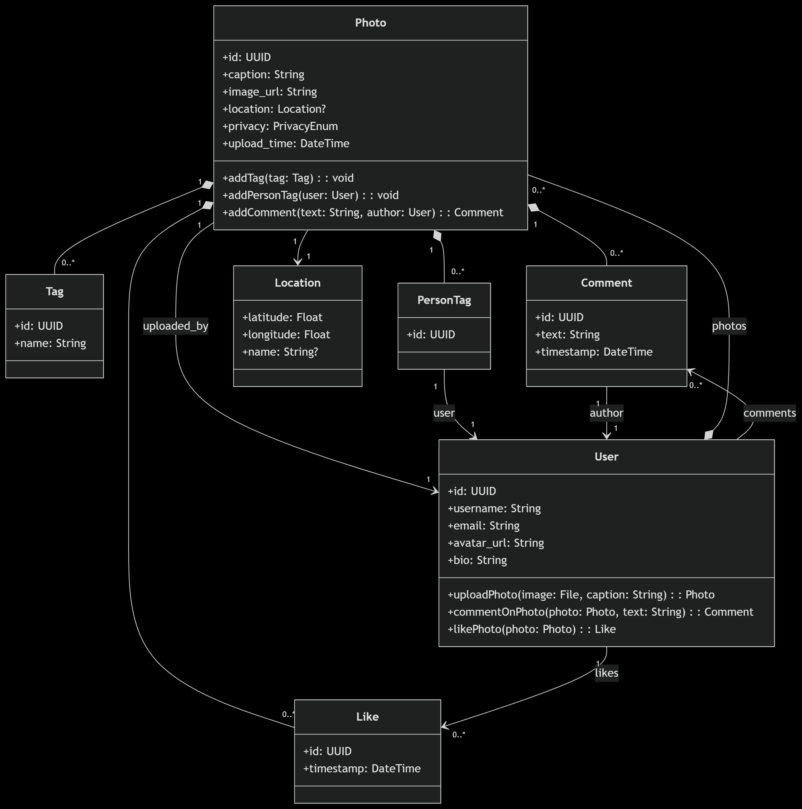

# poc-app-social-media-sharing-photo

## Objective
- Build a Social Media Sharing Photo App (publish photos, tag photos, timeline, comments)


## TODOs:
- split service into two different services, auth-service and photo-service.
- update diagram
- create new service structures

## Diagram



## H2 Console
http://localhost:8080/h2-console
## Liquibase commands
```bash
#run validation
mvn liquibase:validate

#dry-run (show SQL without executing)
mvn liquibase:updateSQL

#execute changes
mvn liquibase:update

#rollback changes
mvn liquibase:rollback -Dliquibase.rollbackCount=1
```


## Test data
```SQL
-- test user
INSERT INTO APP_USER VALUES ('b0262dad-0398-4762-aba0-1dc64a68dfc3', 'UserTest', 'email@email.com', 'my_avatar_location','blablabla');


```